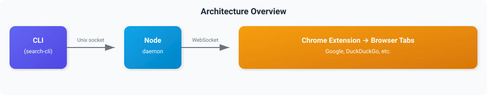

# chrome-cli-search

A CLI tool that runs web searches and interacts with Chrome tabs from the terminal.

It works by launching a local daemon that bridges the command line to a Chrome extension, which performs the actual browser operations.

## Features

- **Search**: `search-cli google "query"` and `search-cli ddg "query"` — run searches and get page text
- **Visit**: `search-cli visit "https://example.com"` — fetch page content from any URL
- **Snapshot**: `search-cli snapshot` — label interactive elements on the current tab with IDs, or `snapshot --context` to print the page text with those IDs inlined in place
- **Interact**: `search-cli click <ID>` and `search-cli type <ID> "text"` — click elements and type into inputs
- **Fields**: `search-cli fields` — list only the editable fields on the tab, with labels
- **Type by label**: `search-cli type --label Subject "text"` — type into a field by its label, no ID needed
- **Type into focus**: `search-cli type --focused "text"` — type into whatever input is focused (add `--force` for custom fields)
- **Keystrokes**: `search-cli key <keys...>` — send keys to the page (add `--trusted` to move focus on Tab)
- **Clear labels**: `search-cli clearlabels` — remove the snapshot overlay from the current tab
- **Close tabs**: `search-cli closetabs` — close every tab the tool has opened
- **Screenshot**: `search-cli screenshot` — capture the current tab as PNG

## Installation

### 1. Install the CLI

```bash
cd cli
npm install
```

### 2. Install the Chrome Extension

1. Open `chrome://extensions` in Chrome
2. Enable **Developer mode** (top-right toggle)
3. Click **Load unpacked** and select the `extension/` directory from this repo

### 3. Use It

```bash
# Start the background daemon (auto-started on first use)
./bin/search-cli.js start

# Search Google
./bin/search-cli.js google "pi calculator"

# Search DuckDuckGo with links only
./bin/search-cli.js ddg "node.js docs" --links

# Visit a URL with custom wait time
./bin/search-cli.js visit "https://example.com" --wait=3000

# Interact with the current tab
./bin/search-cli.js snapshot
./bin/search-cli.js snapshot --context
./bin/search-cli.js click AB
./bin/search-cli.js type CD "hello world"
./bin/search-cli.js screenshot ~/Desktop/page.png

# Fill form fields by label instead of hunting for IDs
./bin/search-cli.js fields                                  # list the editable fields
./bin/search-cli.js type --label "To recipients" "a@b.com"
./bin/search-cli.js type --label Subject "hello there"
./bin/search-cli.js type --focused "into whatever is focused"

# Send keystrokes
./bin/search-cli.js key Enter
./bin/search-cli.js key Ctrl+k
./bin/search-cli.js key g i              # a sequence: g then i
./bin/search-cli.js key / --in AB        # focus element AB, then press /
./bin/search-cli.js key Tab --trusted    # real key event: actually moves focus

# Remove the snapshot overlay / close the tool's tabs
./bin/search-cli.js clearlabels
./bin/search-cli.js closetabs
```

## Filling form fields

Snapshots can list hundreds of elements, which makes finding a specific input
tedious. Two commands target inputs directly:

- `fields` lists only the editable fields (input, textarea, contenteditable,
  `role=textbox`) with a label built from `aria-label`, `aria-labelledby`, the
  associated `<label>`, `placeholder`, `name`, or `title`.
- `type --label <label> <text>` types into the field whose label matches
  (case-insensitive: exact, then starts-with, then contains). If nothing matches,
  the error lists the available field labels. `type --focused <text>` types into
  the currently focused input, and `--force` handles custom widgets by inserting
  through `execCommand`.

Both search every frame, so fields inside iframes are covered.

## Sending keystrokes

`key` takes one or more chords, sent in order. Combine a key with modifiers using
`+`, e.g. `Ctrl+k`, `Shift+Tab`, `Cmd+Enter`. Modifier names: `Ctrl`/`Control`,
`Shift`, `Alt`/`Option`, `Meta`/`Cmd`/`Command`/`Win`.

Named keys (case-insensitive): `Enter`, `Tab`, `Escape`/`Esc`, `Backspace`,
`Delete`, `Space`, `ArrowUp`/`Up`, `ArrowDown`/`Down`, `ArrowLeft`/`Left`,
`ArrowRight`/`Right`, `Home`, `End`, `PageUp`, `PageDown`. Any single character
(letter, digit, or symbol) sends that key.

Options:

- `--in <ID>` — focus the given snapshot element first, then send the keys.
- `--trusted` — dispatch real browser key events through `chrome.debugger` (CDP)
  instead of synthetic DOM events. Use this when you need the default action of a
  key, such as `Tab` actually moving focus to the next field. Without it, keys are
  synthetic (`isTrusted: false`), so sites that run their own key handlers respond,
  but the browser's built-in behaviors (like tab-order focus) do not fire. Trusted
  mode briefly attaches the debugger to the tab, which shows Chrome's "started
  debugging this browser" banner.

## Architecture



The CLI spawns a background daemon that maintains a WebSocket connection to the Chrome extension. All browser operations (tab creation, page content extraction, element interaction) happen inside the extension.

## Requirements

- Node.js 18+
- Google Chrome (or Chromium-based browser)
